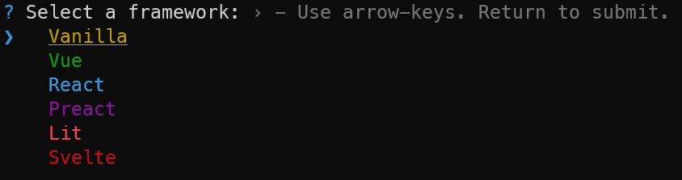
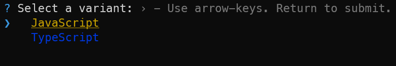
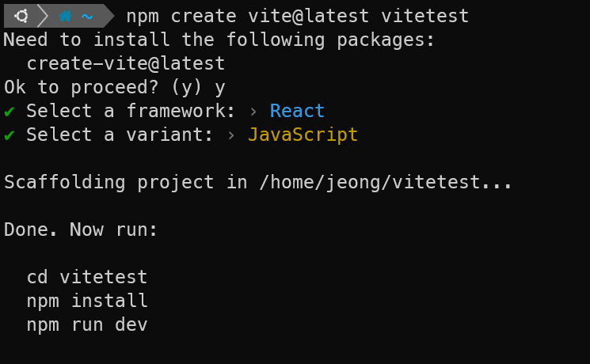

- ### CRA


처음부터 `react`, `react-dom`, `react-scripts` 등 템플릿 설치하는데 21초가 걸렸고(이 부분에서 제일 오래 걸렸다.) 기타 다른 dependencies가 설치되는데도 시간이 더해져서 30초 정도 소요됐다.

- ### Vite



먼저 어떤 framework를 쓸 거냐고 물어본다. 당연히 React..



선택하면 JS를 쓸건지 TS를 쓸건지 물어본다. 일단 팀원들 모두 타입스크립트에는 익숙하지 않기 때문에 JS로 골랐다.



끝났다.. 10초도 안걸림..

일단 설치 자체로 보면 vite가 압도적이고

vite가 CRA와 다른 점은 파일이 `.jsx`로 되어있다.

### 플러그인 세팅

```js
//vite.config.js
import { defineConfig } from "vite";
import react from "@vitejs/plugin-react";

export default defineConfig({
  plugins: [react()],
});
```
